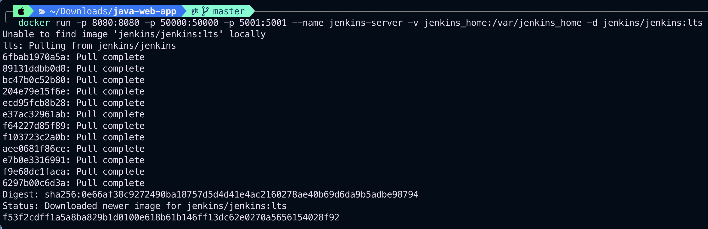
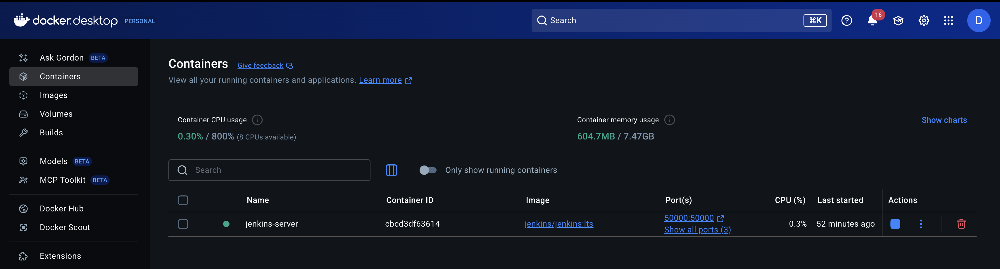
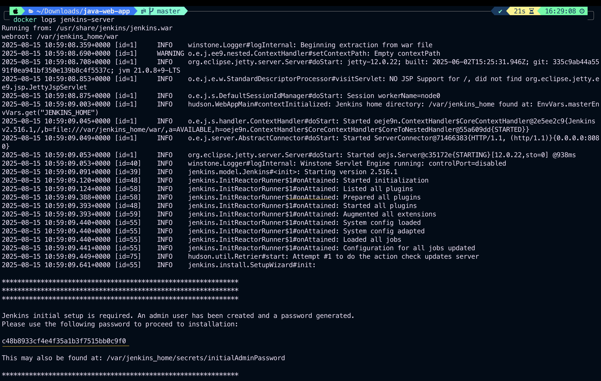
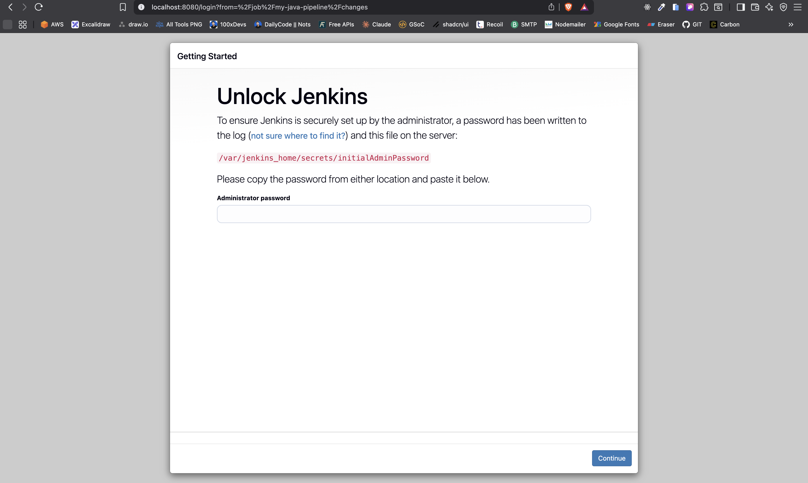
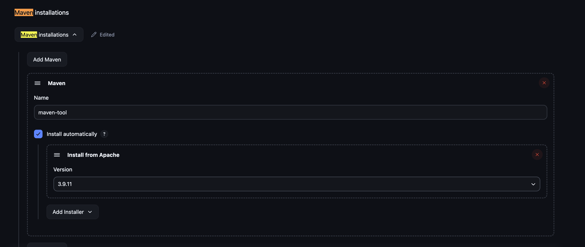
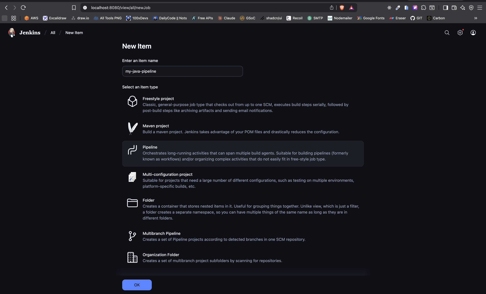
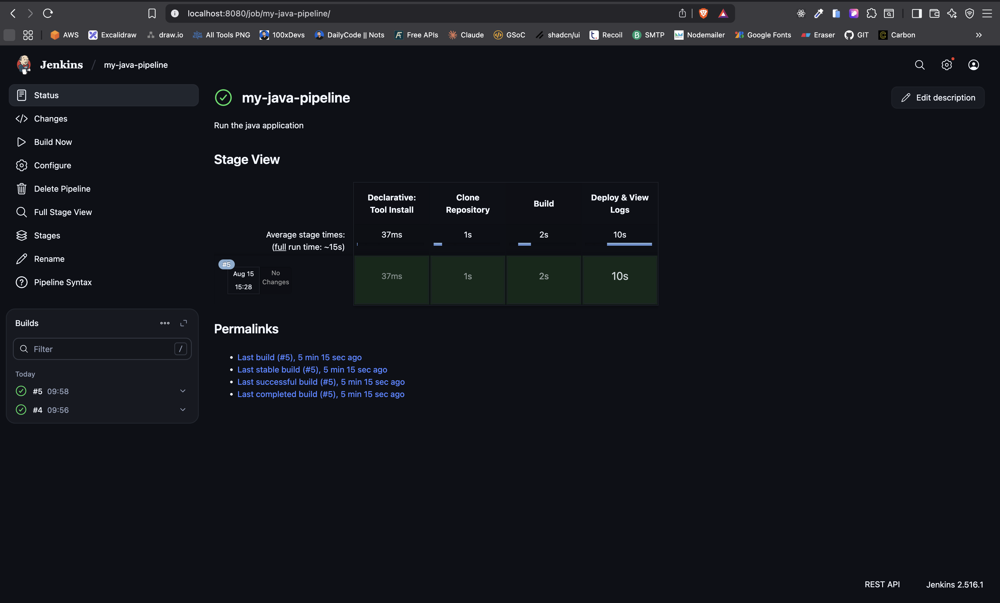
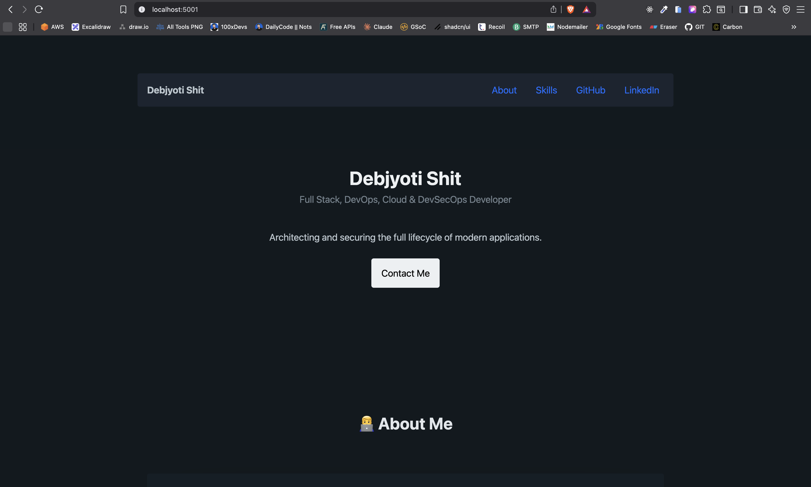

# My Java Portfolio Web App

This is a professional portfolio website built as a modern Java web application using the Spring Boot framework.

## 🚀 Description

This project serves a single-page, responsive portfolio website that showcases my skills as a Full Stack, DevOps, Cloud, and DevSecOps Developer. The backend is built with Java and Spring Boot, and the frontend is a dynamic HTML page styled with Pico.css.

---

## Home Page

## 🛠️ Prerequisites

Before you begin, ensure you have the following software installed on your machine:

1.  **Java Development Kit (JDK)** - Version 17 or later.
2.  **Apache Maven** - Version 3.9 or later.

You can verify your installations by running `java -version` and `mvn -version` in your terminal.

---
## 🏃 How to Run

Follow these steps to get the application running on your local machine.

### 1. Clone the Repository
First, clone this repository to your local machine using Git:
```bash
git clone https://github.com/Debjyoti2004/GitHub-Action-On-Java.git
cd GitHub-Action-On-Java
```
## Build and Run the Application
This project uses the Maven wrapper, so you don't need a system-wide Maven installation. Use the following command to build the project and run the web server:

```bash
./mvnw spring-boot:run
```


(On Windows, *use mvnw.cmd spring-boot:run*)

The application will start, and the embedded Tomcat server will be running on port *5001*.

## 🌐 Accessing the Application
Once the application is running, you can view your portfolio:
1. Open your favorite web browser.
2. Navigate to the following URL:
*http://localhost:5001*


# Jenkins CI/CD Pipeline Setup Guide

This guide provides step-by-step instructions on how to set up a Jenkins CI/CD pipeline to automatically build and deploy this Java Spring Boot application using Docker.

##  Prerequisites

Before you start, make sure you have the following installed on your machine:
* **Docker**: To run the Jenkins server in a container.
* **Git**: To clone this repository.

---
## Step 1: Start the Jenkins Docker Container

We will run Jenkins in a Docker container using the host's network. This is crucial for allowing the deployed application to be accessible from `localhost`.

1.  Open your terminal and run the following command:
    ```bash
    docker run -p 8080:8080 -p 50000:50000 -p 5001:5001 --name jenkins-server -v jenkins_home:/var/jenkins_home -d jenkins/jenkins:lts
    ```
    
    This command does the following:
    * Maps port 8080 of the container to port 8080 on the host (Jenkins UI).
    * Maps port 50000 of the container to port 50000 on the host (Jenkins agent communication).
    * Maps port 5001 of the container to port 5001 on the host (application access).
    * Names the container `jenkins-server`.
    * Creates a Docker volume `jenkins_home` to persist Jenkins data.
    **Container on Docker Desktop**
    

2.  Wait about a minute for Jenkins to initialize.

---
## Step 2: Initial Jenkins Configuration

1.  **Get Admin Password**: Find the initial administrator password by running:
    ```bash
    docker logs jenkins-server
    ```
    Copy the long alphanumeric password found between the asterisks.
    

2.  **Unlock Jenkins**:
    * Open your web browser and navigate to `http://localhost:8080`.
    * Paste the administrator password and click **Continue**.
    

3.  **Install Plugins**: Select **"Install suggested plugins"** to install the standard set of plugins.

4.  **Create Admin User**: Fill out the form to create your personal admin account.

---
## Step 3: Configure Maven in Jenkins

The pipeline needs to know where to find Maven.

1.  On the Jenkins dashboard, go to **Manage Jenkins** → **Tools**.
2.  Scroll to **Maven installations** and click **"Add Maven"**.
3.  Set the **Name** to `maven-tool` (this must match the name in the `Jenkinsfile`).
4.  Enable **"Install from Apache"** and choose a recent version (e.g., 3.9.11).
5.  Click **Save**.



---
## Step 4: Create and Run the Jenkins Pipeline

1.  From the Jenkins dashboard, click **"New Item"**.
2.  Enter an item name (e.g., `my-java-pipeline`).
3.  Select **Pipeline** and click **OK**.
5.  Click **Save**.
6.  You will be taken to the pipeline's main page. Click **"Build Now"** to start the pipeline.


---
## Step 5: Access Your Deployed Application

Once the pipeline build finishes successfully, your portfolio application will be live.
**Stage View**


* Open your web browser and navigate to:
    **[http://localhost:5001](http://localhost:5001)**
    


