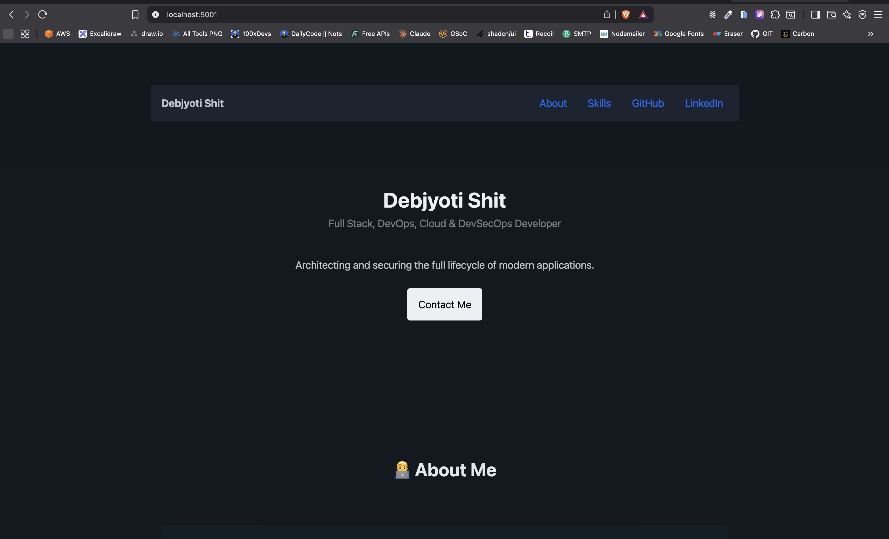

# My Java Portfolio Web App

This is a professional portfolio website built as a modern Java web application using the Spring Boot framework.

## 🚀 Description

This project serves a single-page, responsive portfolio website that showcases my skills as a Full Stack, DevOps, Cloud, and DevSecOps Developer. The backend is built with Java and Spring Boot, and the frontend is a dynamic HTML page styled with Pico.css.

---

## Home Page

## 🛠️ Prerequisites

Before you begin, ensure you have the following software installed on your machine:

1.  **Java Development Kit (JDK)** - Version 17 or later.
2.  **Apache Maven** - Version 3.9 or later.

You can verify your installations by running `java -version` and `mvn -version` in your terminal.

---
## 🏃 How to Run

Follow these steps to get the application running on your local machine.

### 1. Clone the Repository
First, clone this repository to your local machine using Git:
```bash
git clone https://github.com/Debjyoti2004/GitHub-Action-On-Java.git
cd GitHub-Action-On-Java
```
## Build and Run the Application
This project uses the Maven wrapper, so you don't need a system-wide Maven installation. Use the following command to build the project and run the web server:

```bash
./mvnw spring-boot:run
```


(On Windows, *use mvnw.cmd spring-boot:run*)

The application will start, and the embedded Tomcat server will be running on port *5001*.

## 🌐 Accessing the Application
Once the application is running, you can view your portfolio:
1. Open your favorite web browser.
2. Navigate to the following URL:
*http://localhost:5001*

